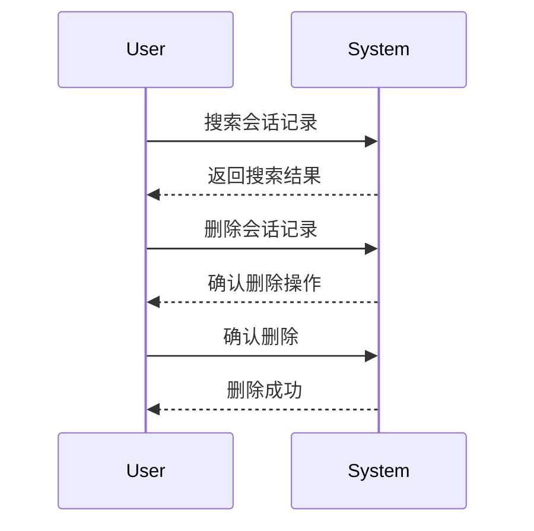

# 历史会话产品说明

## 1. 概述

本产品旨在提供历史会话记录的管理功能，主要包括会话记录的展示、搜索和删除功能。该功能将帮助用户方便地管理和查找历史会话记录。

## 2. 功能需求

### 2.1 会话记录展示

- 会话记录按时间顺序展示，分为“今天”、“昨天”、“更早”三个时间段。
- 单条会话记录标题长度不超过20个字，且不可为空。
- 鼠标hover在单条记录时，弹出“删除”功能按钮，点击“删除”按钮，二次确认后删除该会话记录。
- 若删除的会话记录为当前对话流中正在进行的，删除后，数据刷新的页面为当前所处智能体的新会话页面。
- 默认显示30条记录，超过部分自动加载，每次加载10条。

### 2.2 搜索功能

- 提供模糊搜索功能，用户可以通过输入关键词搜索会话记录。
- 搜索结果按时间顺序展示，不展示时间标签。
- 搜索结果中，第一次出现关键词的句子高亮显示。
- 关键词仅在标题和对话内容中搜索。

## 3. 交互说明

### 3.1 搜索

- 默认搜索框为空，用户可以输入关键词进行搜索。
- 搜索结果中，第一次出现关键词的句子高亮显示。
- 关键词仅在标题和对话内容中搜索。

### 3.2 会话记录

- 会话记录按时间顺序展示，分为“今天”、“昨天”、“更早”三个时间段。
- 单条会话记录标题长度不超过20个字，且不可为空。
- 鼠标hover在单条记录时，弹出“删除”功能按钮，点击“删除”按钮，二次确认后删除该会话记录。
- 若删除的会话记录为当前对话流中正在进行的，删除后，数据刷新的页面为当前所处智能体的新会话页面。
- 默认显示30条记录，超过部分自动加载，每次加载10条。

## 4. 非功能性需求

- 系统应保证会话记录的安全性和隐私性。
- 系统应具备高可用性，保证在高并发情况下的稳定性。

## 5. UML时序图

## 6. 其他说明

- 本需求文档为初步版本，后续可能根据实际情况进行调整和补充。
