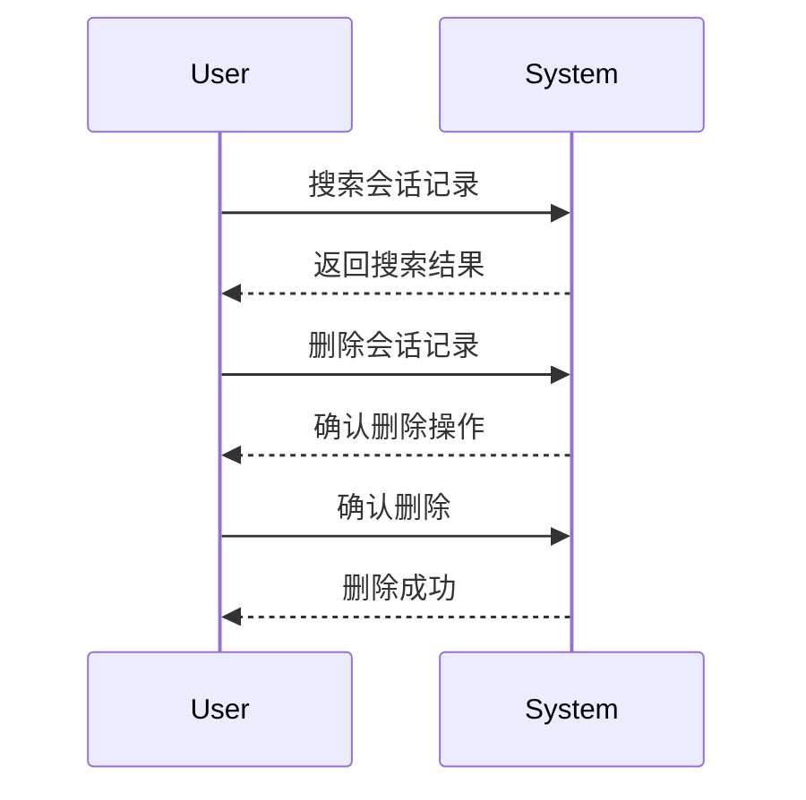

### 历史会话前端详细设计

#### 1. 概述
本设计文档旨在详细描述历史会话功能的前端实现，包括会话记录的展示、搜索和删除功能。该功能将帮助用户方便地管理和查找历史会话记录。

#### 2. 功能描述
- **会话记录展示**：按时间顺序展示会话记录，分为“今天”、“昨天”、“更早”三个时间段。
- **搜索功能**：提供模糊搜索功能，用户可以通过输入关键词搜索会话记录。
- **删除功能**：用户可以删除单条会话记录，删除前需进行二次确认。

#### 3. 界面设计
界面设计包括会话记录列表、搜索框和删除确认弹窗。

##### 3.1 会话记录列表
- 会话记录按时间顺序展示，分为“今天”、“昨天”、“更早”三个时间段。
- 单条会话记录标题长度不超过20个字，且不可为空。
- 鼠标hover在单条记录时，弹出“删除”功能按钮。

##### 3.2 搜索框
- 提供模糊搜索功能，用户可以通过输入关键词搜索会话记录。
- 搜索结果按时间顺序展示，不展示时间标签。
- 搜索结果中，第一次出现关键词的句子高亮显示。

##### 3.3 删除确认弹窗
- 用户点击“删除”按钮后，弹出确认删除的弹窗。
- 用户确认删除后，删除该会话记录。

#### 4. 交互流程
以下是用户与系统之间的交互流程：



#### 5. 技术实现
技术实现部分包括前端代码结构、主要组件和功能实现。

##### 5.1 前端代码结构
```
src/
├── components/
│   ├── HistoryList.vue
│   ├── SearchBox.vue
│   └── DeleteConfirm.vue
├── views/
│   └── History.vue
└── utils/
    └── api.js
```

##### 5.2 主要组件
- **HistoryList.vue**：会话记录列表组件，负责展示会话记录。
- **SearchBox.vue**：搜索框组件，负责处理搜索功能。
- **DeleteConfirm.vue**：删除确认弹窗组件，负责处理删除确认操作。

##### 5.3 功能实现
- **会话记录展示**：通过API获取会话记录数据，并按时间顺序展示。
- **搜索功能**：通过API进行模糊搜索，并高亮显示搜索结果中的关键词。
- **删除功能**：通过API删除指定的会话记录，并刷新列表。

#### 6. 其他说明
- 系统应保证会话记录的安全性和隐私性。
- 系统应具备高可用性，保证在高并发情况下的稳定性。

以上是历史会话功能的前端详细设计文档。请检查文档内容是否符合你的要求，如果有任何修改或补充，请告诉我。